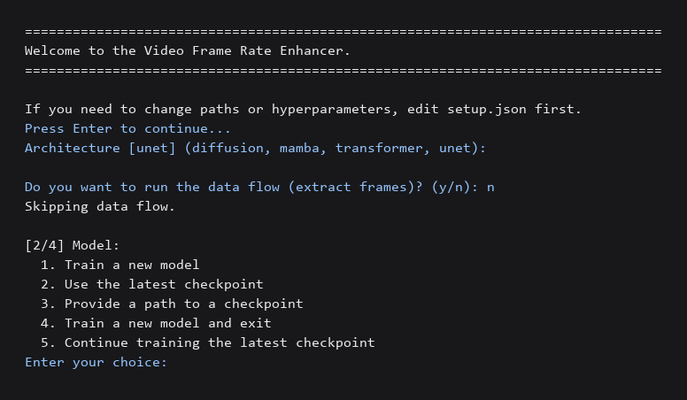

# Video Frame Rate Enhancer

A learned frame-interpolation pipeline that doubles the frame rate of any
input video. Given two consecutive frames, the model predicts the frame
that lies between them; inserting that prediction between every original
pair yields a smoother output at twice the source FPS.

The project is written in PyTorch and ships four interchangeable
architectures so the same pipeline can compare baselines against more
recent designs.

| Original 30 fps | Enhanced 60 fps |
| :-: | :-: |
| [assets/30fps.mp4](assets/30fps.mp4) | [assets/60fps.mp4](assets/60fps.mp4) |

## Architectures

All architectures share the same forward signature
``model(frame_prev, frame_next) -> frame_mid`` and are selected by name
in `setup.json` or interactively when running the pipeline.

| Name          | Notes |
| ------------- | ----- |
| `unet`        | U-Net with skip connections. Strong baseline, fast to train. |
| `diffusion`   | Conditional latent denoiser with sinusoidal time conditioning, single-pass. |
| `transformer` | Patch-token ViT with a convolutional skip path for high-frequency detail. |
| `mamba`       | Bidirectional selective state-space (Mamba-style) tokens, pure PyTorch. |

## Project layout

```
CreatingModel/         model definitions and training
    UNetModel.py
    DiffusionModel.py
    TransformerModel.py
    MambaModel.py
    Losses.py
    TrainingModel.py
FolderOperations/      orchestrators that wrap the lower-level steps
    DataFlow.py
ImageOperations/       per-image utilities and the torch dataset
    ImageIO.py
    Dataset.py
    ScaleDownImages.py
    GenerateFrames.py
VideoOperations/       video <-> frames I/O
    ExtractingFrames.py
    AssembleVideo.py
    EnhanceVideos.py
utilities/             cross-cutting helpers
    Config.py
    Checkpoints.py
    Devices.py
    Prompts.py
Test/                  pytest suite
main.py
setup.json
requirements.txt
```

Each file has a single responsibility and the layers depend downward only:
`main.py` -> `FolderOperations` -> `ImageOperations` / `VideoOperations`
-> `CreatingModel` -> `utilities`. Models are pluggable through the
registry in `CreatingModel/__init__.py`, so adding a new architecture is
a one-file change plus a registry entry.

## Installation

Python 3.10 or newer is recommended.

```bash
git clone https://github.com/Udaydsmls/VideoFrameRateEnhancer.git
cd VideoFrameRateEnhancer
python -m venv .venv
source .venv/bin/activate          # PowerShell: .venv\Scripts\Activate.ps1
pip install -r requirements.txt
```

For CUDA acceleration, install the matching PyTorch build from
[pytorch.org](https://pytorch.org/get-started/locally/) before
installing the rest of the requirements.

## Configuration

`setup.json` controls every path and hyperparameter:

| Field | Purpose |
| ----- | ------- |
| `absolute_path` | Optional base directory; defaults to the repo root. |
| `root_dir` | Working directory created under `absolute_path`. |
| `videos_dir` | Input videos. |
| `frames_dir` | Extracted frames, one subdirectory per video. |
| `interpolated_frames_dir` | Frames produced at inference. |
| `enhanced_videos_dir` | Final 2x-fps videos. |
| `checkpoints_dir` | Saved model weights. |
| `architecture` | One of `unet`, `diffusion`, `transformer`, `mamba`. |
| `scale_factor` | Resize factor applied during extraction. `1.0` keeps source resolution. |
| `image_size` | Optional `[height, width]` override applied during training. |
| `num_epochs`, `batch_size`, `learning_rate`, `validation_split` | Training hyperparameters. |
| `num_workers` | DataLoader worker count. |
| `device` | `auto`, `cpu`, `cuda`, or `mps`. |

## Usage

Place your videos in `<root>/videos`, then run:

```bash
python main.py
```



The script walks through the pipeline interactively:

1. Pick the architecture (defaults to whatever is set in `setup.json`).
2. Optionally extract frames from the videos.
3. Choose between training a new model, using the latest checkpoint,
   loading a checkpoint by path, training and exiting, or continuing
   from the latest checkpoint.
4. Generate intermediate frames with the chosen model.
5. Encode every video at twice its source frame rate.

## Tests

```bash
pytest Test
```

The suite covers configuration loading, frame extraction, the dataset,
video assembly, every architecture and a short end-to-end training
plus inference run on synthetic data.

## License

Released under the [MIT License](LICENSE).
